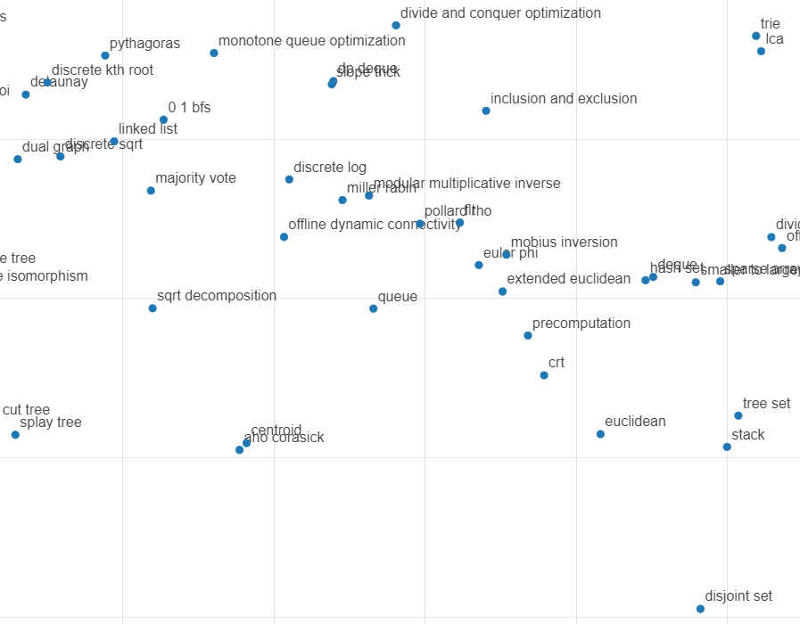

# Algorithms-TSNE
How are algorithms really related? We use tag data from solved.ac and matrix factorization to find out.

## Introductions

First we collect datas from [solved.ac](https://solved.ac/problems/tags) to find problems with tags. Here, by tags we mean algorithms. We use these tags as "items" and problems as "users", and do matrix factoriztion.
We could've used other MF algorithms, but here we just use naive methods with Gradient descent, which is, not ideal but fast to implement and not think about it.
To embed the plot on my personal blog, I've used bokeh. We also get feature data on how other problems are related with other algorithms, but this was unused.
Try out this interactive plot here:

https://www.simoryu.com/algo_plot

Entire process is in the repo, so check out if you are interested.
